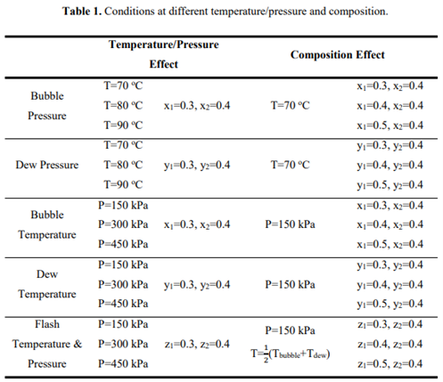

# **Thermodynamics Project (ChE321)**
## Authors: *Daglar Berk Erdem* & *Berk Korkut* & *Zeynep Otan*
## Introduction
Project is based on the understanding of the vapor-liquid equilibrium (VLE). Equilibrium means a static condition in which no changes occur in the macroscopic properties of a system in a time. In the job of engineering, such equilibrium conditions are very important. So, for the engineers writing this kind of programs are necessary. The scope of this project is to write a program which calculates Bubble, Dew Temperature&Pressure and Flash Calculations based on following formulations:
* Raoult's Law (RL)
* Modified Raoult's Law (MRL)
* gama-phi formulation

and for three systems:
* acetone (1)/methanol (2)/water (3)
* methyl acetate (1)/benzene (2)/water (3) 
* acetone (1)/methanol (2)/benzene (3)

Given properties for the project calculation are given in Table 1. and Excel Spreadsheet (ThermoMaxi.xlsx). Introduction to Chemical Engineering Thermodynamics, 7th ed.  by J.M. Smith, H.C Van Ness, M.M.Abbott, published by McGraw Hill International is used as a reference book all through the project. Constants, equations and some characteristic properties of pure species such as Tc, Pc, w, etc. are obtained from the reference book.\
**Note that this algortihm is capable of performing the same calculations by using same methods for N different components, which is beyond the problem statement.**
### Table.1 

## Installation
Clone this git repository by using the command:
```
git clone https://github.com/dberkerdem/Thermodynamics-Project.git
```
## Usage
This project is available in .m extension, can be used with MATLAB.
Run ThermoMaxi.m script as the main method.
## License
[MIT](https://choosealicense.com/licenses/mit/)
